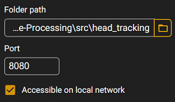

# PGI010-Digital-Image-Processing

Repository containing projects for Digital Image Processing discipline (PPGI010) offered by the postgraduate program in IT at the Computing Institute of the Federal University of Alagoas.

This repository contains as main projects:
* Implementation of Head Tracking for Desktop VR Display using Mediapipe, OpenCV and A-frame;
* Adaptation of codes from the book Digital Image Processing Using Matlab to Python using Jupyter Notebook;
* Other activities related to the discipline;
<!-- Put some gif here -->
<!--  -->

## 💻 Prerequisites

Before you begin, make sure you have installed the following tools:

- [Miniconda](https://docs.anaconda.com/free/miniconda/) (24.4.0)
- [Simple Web Server](https://simplewebserver.org/download.html) (1.2.11)

## 🛠 Installing

To install the application, follow these steps:

1. Create an virtual enviroment using conda and activate it:
```
conda create --name pdi python=3.8.19
conda activate pdi
```
> This application uses version 3.8.19 of Python for better compatibility with OpenCV.

2. Install the dependecies with pip:
```
pip install -r .\requirements.txt
```
> This requirements contains both libraries for Head-Tracking VR Display and DIPUM.

3. Install jupyter using conda:

```
conda install anaconda::jupyter
```

4. Create a server for A-frame using Simple Web Server:

Just create a normal server using the port you desire, remember to check "<em>Accessible on local network</em>".




## 🚀 Running the project

* To run <strong>Head-Tracking VR</strong>, go to the src/head_tracking_vr/ directory and run the following command:

```
python main.py
```
After that, just access the application in any browser using the chosen port. 

Example: http://localhost:8080

* To run Jupyter Notebook to access <strong>DIPUM</strong>, you just need to execute the following command:

```
jupyter notebook
```

## 📚 References

#### Head Tracking VR Display
- [Head Tracking for Desktop VR Displays using the WiiRemote](https://youtu.be/Jd3-eiid-Uw)
- [A Simple and efficient Face direction detection in React](https://medium.com/@sshadmand/a-simple-and-efficient-face-direction-detection-in-react-e02cd9d547e5)
- [MediaPipe Face Mesh](https://github.com/google-ai-edge/mediapipe/wiki/MediaPipe-Face-Mesh#metric-3d-space)
#### Digital Image Processing Using MATLAB®
- [Rafael C. Gonzalez, Richard E. Woods, and Steven L. Eddins. 2003. Digital Image Processing Using MATLAB. Prentice-Hall, Inc., USA.](https://www.cin.ufpe.br/~sbm/DEN/Digital%20Image%20Processing%20Using%20Matlab%20(Gonzalez).pdf)