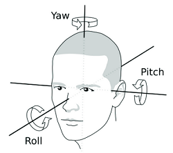

# Head Tracking VR Display 🥽

This section of the repository contains an implementation of Head-tracking for a desktop VR display using Mediapipe, OpenCV and A-frame. The application uses a webcam to track the user's head movements and translates those movements into a VR environment built with A-frame. It leverages MediaPipe Face Mesh for facial landmark detection, OpenCV for video capture, and WebSockets for real-time data transmission to the VR environment.

### Head Orientation
The core of the head tracking functionality is in calculating the head orientation using facial landmarks. The application identifies key points on the face, such as the nose tip, chin, and outer corners of the eyes. It then computes vectors between these points to determine the head's roll, pitch, and yaw angles, which are essential for accurate head orientation tracking.

> You can check how MediaPipe works and how are distributed the landmarks [here](https://ai.google.dev/edge/mediapipe/solutions/vision/face_landmarker?hl=pt-br).

### VR Environment Integration

The A-frame VR environment receives the head tracking data through WebSocket messages. The VR scene contains various objects and a camera entity. The camera's position and rotation attributes are updated based on the received data, reflecting the user's real-time head movements. This creates an immersive VR experience where the camera moves and rotates according to the user's head orientation.